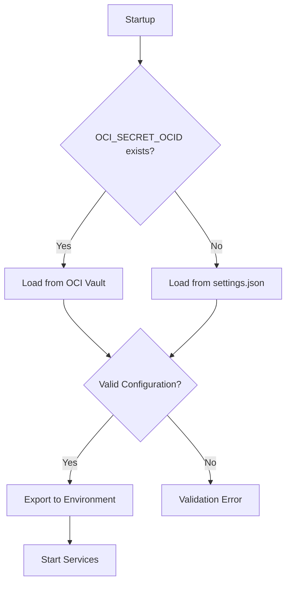

# Architecture Overview

> **🎯 Design Philosophy**: Modular, portable, and automated architecture that adapts to any environment while maintaining enterprise-grade security and reliability.

## 🏗️ **Core Architecture Principles**

### **1. Dynamic Configuration System**
**No hardcoded paths or names** - Everything adapts based on project location:

```bash
# Project identity derived from directory name
PROJECT_NAME="$(basename "$ROOT_DIR" | tr '[:upper:]' '[:lower:]' | sed 's/[^a-z0-9-]/-/g')"

# All paths computed dynamically
PROJECT_STATE_DIR="/var/lib/${PROJECT_NAME}"
SERVICE_NAME="${PROJECT_NAME}.service"
NETWORK_NAME="${PROJECT_NAME}_network"
```

**Benefits**:
- **Portability**: Clone to any directory name, everything adapts
- **Multi-instance**: Run multiple deployments without conflicts
- **Zero Configuration**: No manual path configuration required
- **Container Isolation**: Project-specific network namespaces

### **2. Modular Library System**
**Reusable bash libraries** with single responsibility principle:

```
lib/
├── config.sh          # Configuration loading and path management
├── logging.sh          # Centralized logging with colors and formatting
├── validation.sh       # System requirements and health validation
├── system.sh          # OS package management and service control
├── monitoring.sh      # Health checks and self-healing logic
├── backup-core.sh     # Backup orchestration and lifecycle
├── backup-formats.sh  # Multiple export format implementations
└── restore-lib.sh     # Data restoration utilities
```

**Architecture Benefits**:
- **Code Reuse**: Common functions shared across all scripts
- **Consistency**: Standardized logging, error handling, validation
- **Maintainability**: Changes in one library affect all consumers
- **Testing**: Individual libraries can be unit tested

### **3. Configuration Management Architecture**

#### **Multi-Source Configuration Loading**
```bash
Configuration Priority (First Available Wins):
1. OCI Vault (if OCI_SECRET_OCID environment variable set)
2. Local settings.json file
3. Environment variables (systemd integration)
4. Interactive prompts (during setup)
```

#### **Configuration Flow**


#### **Secret Management Security**
- **In-Memory Only**: Secrets loaded directly into environment, never written to disk
- **Automatic Fallback**: OCI Vault failures fall back to local files
- **Validation**: All configuration validated before export
- **Backup Integration**: Local config automatically backed up before changes

## 🐳 **Container Architecture**

### **Service Stack Design**

```yaml
Services:
  vaultwarden:     # Core application
    resources:     # CPU: 1.0 cores, RAM: 2GB limit
    health_check:  # HTTP endpoint monitoring
    dependencies:  # None (can start independently)
    
  caddy:          # Reverse proxy + SSL
    resources:     # CPU: 0.5 cores, RAM: 512MB limit  
    health_check:  # Metrics endpoint monitoring
    dependencies:  # Waits for vaultwarden healthy
    
  fail2ban:       # Security monitoring
    network_mode:  # Host network (required for iptables access)
    capabilities:  # NET_ADMIN, NET_RAW
    dependencies:  # Starts after caddy
    
  watchtower:     # Automated updates
    resources:     # CPU: 0.25 cores, RAM: 256MB limit
    schedule:      # Configurable (default: monthly)
    dependencies:  # No dependencies
    
  ddclient:       # Dynamic DNS (optional)
    profiles:      # Only starts if DDNS enabled
    resources:     # CPU: 0.1 cores, RAM: 128MB limit
    dependencies:  # No dependencies
```

### **Network Architecture**

#### **Dynamic Network Isolation**
```bash
# Compute unique subnet to prevent conflicts
SUBNET_CALC='${shell echo "${COMPOSE_PROJECT_NAME:-vaultwarden}" | md5sum | tr -dc "0-9" | cut -c1-3 | sed "s/^0*//" | awk "{print ($$1 % 240) + 16}"}'

# Results in project-specific subnet: 172.X.0.0/24
networks:
  default:
    name: ${PROJECT_NAME}_network
    driver: bridge
    ipam:
      config:
        - subnet: 172.${SUBNET_CALC}.0.0/24
```

**Benefits**:
- **Conflict Prevention**: Each project gets unique subnet
- **Isolation**: Network-level separation between deployments
- **Consistency**: Predictable internal IP ranges
- **Debugging**: Clear network namespace identification

#### **Port Management**
```yaml
External Ports (Host):
  80/tcp:  HTTP  → Caddy (redirect to HTTPS)
  443/tcp: HTTPS → Caddy → VaultWarden:8080

Internal Ports (Container Network):
  vaultwarden:8080  # Application server
  caddy:2019        # Admin/metrics endpoint
  caddy:80,443      # HTTP/HTTPS proxy
```

### **Storage Architecture**

#### **Data Volume Strategy**
```yaml
Volume Types:
  Bind Mounts:      # Direct host path mapping
    - ./caddy:/etc/caddy-extra:ro           # Configuration
    - ./fail2ban:/data                      # Jail configs
    - ${PROJECT_STATE_DIR}/data:/data       # Application data
    - ${PROJECT_STATE_DIR}/logs:/logs       # Log aggregation
    
  Named Volumes:    # Docker-managed persistent storage
    - caddy_data    # SSL certificates
    - caddy_config  # Caddy runtime config
```

#### **Directory Structure**
```bash
/var/lib/${PROJECT_NAME}/        # Dynamic project data directory
├── data/
│   └── bwdata/                  # VaultWarden application data
│       ├── db.sqlite3           # Primary database
│       ├── attachments/         # File attachments
│       └── sends/               # Bitwarden Send files
├── logs/                        # Centralized logging
│   ├── vaultwarden/            # Application logs
│   ├── caddy/                  # Access and error logs
│   ├── fail2ban/               # Security logs
│   ├── watchtower/             # Update logs
│   └── ddclient/               # DDNS logs
├── backups/                    # Automated backup storage
│   ├── db/                     # Database backups
│   └── full/                   # Complete system backups
├── config-backups/             # Configuration versioning
└── state/                      # Runtime state tracking
```

## 🔄 **Startup and Orchestration Architecture**

### **Startup Contract**
```bash
Mandatory Entry Point: startup.sh
├── Never use 'docker compose up' directly
├── Handles configuration loading and validation
├── Manages service dependencies and health checks
└── Provides consistent logging and error handling
```

### **Startup Sequence**
```bash
1. System Validation
   ├── Root privileges check
   ├── Docker daemon validation  
   ├── Compose file syntax validation
   └── Network connectivity test

2. Configuration Loading
   ├── OCI Vault attempt (if configured)
   ├── Local file fallback
   ├── Environment variable export
   └── Configuration validation

3. Runtime Environment Preparation
   ├── Dynamic directory creation
   ├── File permission enforcement
   ├── Placeholder file generation
   └── Pre-startup task execution

4. Service Orchestration
   ├── Dependency-aware startup
   ├── Health check validation
   ├── Service status reporting
   └── Troubleshooting information
```

### **Health Check Architecture**
```yaml
Health Check Layers:
  Container Level:     # Docker native health checks
    vaultwarden:       # HTTP /alive endpoint every 30s
    caddy:            # Metrics endpoint every 30s
    ddclient:         # Process and config file checks
    
  Application Level:   # Custom monitoring via monitor.sh
    database:         # SQLite integrity and performance
    ssl_certificates: # Expiration and validity checks
    disk_space:       # Usage monitoring and alerting
    network:          # Connectivity and DNS resolution
    
  System Level:       # OS-level monitoring
    memory_usage:     # Container memory consumption
    cpu_usage:        # Container CPU utilization
    log_rotation:     # Log size management
    backup_status:    # Backup completion verification
```

## 🔐 **Security Architecture**

### **Multi-Layer Security Design**

#### **Layer 1: Network Security**
```bash
CloudFlare Edge Protection:
├── DDoS mitigation and bot detection
├── Geographic access control
├── Rate limiting and challenge pages
└── SSL/TLS termination with modern ciphers

UFW Host Firewall:
├── Default deny all incoming
├── Allow SSH (22), HTTP (80), HTTPS (443) only
├── Automatic rule management
└── Integration with fail2ban

Fail2ban Intrusion Detection:
├── SSH brute force protection
├── VaultWarden auth failure detection
├── Caddy access pattern analysis
├── CloudFlare API integration for edge blocking
└── Automatic IP blacklisting with configurable thresholds
```

#### **Layer 2: Application Security**
```bash
Container Security:
├── Non-root execution where possible
├── Resource limits preventing DoS
├── Read-only filesystems where applicable
└── Minimal attack surface (no unnecessary packages)

SSL/TLS Configuration:
├── Automatic Let's Encrypt certificate management
├── Perfect Forward Secrecy (PFS)
├── HTTP Strict Transport Security (HSTS)
├── Modern cipher suite enforcement
└── Security header implementation
```

#### **Layer 3: Data Security**
```bash
File System Security:
├── 600 permissions on sensitive configuration files
├── 700 permissions on data directories
├── Root ownership for system files
└── Regular permission auditing

Backup Security:
├── AES-256 encryption for all backups
├── Secure passphrase generation and rotation
├── Integrity verification for all backup files
└── Secure deletion of temporary files
```

### **Fail2ban Integration Architecture**

#### **Jail Configuration System**
```bash
Dynamic Jail Management:
├── Template-based configuration (jail.local → jail.d/jail.local)
├── CloudFlare action substitution ({{FAIL2BAN_ACTION}})
├── Multi-tier protection (SSH, HTTP, admin panel)
└── Recidivist tracking with escalating penalties

Log Analysis Patterns:
├── VaultWarden authentication failures
├── Caddy access pattern anomalies
├── SSH brute force attempts
├── Admin panel unauthorized access
└── Vulnerability scanning detection
```

#### **CloudFlare Edge Integration**
```bash
Action Flow:
1. Local Detection → fail2ban jail triggers
2. API Call → CloudFlare firewall rules
3. Edge Blocking → IP blocked at CDN level
4. Log Correlation → Centralized security logging
```

## 🔧 **Automation Architecture**

### **Cron-Based Automation System**
```bash
Automation Categories:
├── Health Monitoring (*/5 * * * *) - Every 5 minutes
│   ├── Container health validation
│   ├── Resource usage monitoring  
│   ├── Database integrity checks
│   └── Automatic service recovery
│
├── Data Management (0 1 * * *) - Daily at 1 AM
│   ├── Database backup creation
│   ├── Backup integrity verification
│   ├── Old backup cleanup
│   └── Storage usage reporting
│
├── Security Maintenance (0 3 * * *) - Daily at 3 AM
│   ├── CloudFlare IP range updates
│   ├── SSL certificate monitoring
│   ├── Security log analysis
│   └── Fail2ban status reporting
│
└── System Maintenance (0 2 * * 1) - Weekly Monday 2 AM
    ├── Database optimization (VACUUM, ANALYZE)
    ├── Log rotation and compression
    ├── Container image updates
    └── System resource cleanup
```

### **Self-Healing Architecture**
```bash
Monitoring → Detection → Recovery → Notification

Detection Triggers:
├── Container exit or unhealthy status
├── High resource usage (memory/CPU/disk)  
├── Database connection failures
├── SSL certificate expiration warnings
└── Network connectivity issues

Recovery Actions:
├── Container restart with exponential backoff
├── Log rotation to free disk space
├── Database integrity repair attempts
├── Service dependency resolution
└── Configuration validation and repair

Escalation Path:
├── Automatic recovery attempted (3 retries)
├── Email notification on persistent failures
├── Detailed log collection for debugging
└── Safe mode activation for critical failures
```

## 📊 **Monitoring and Observability Architecture**

### **Logging Architecture**
```bash
Centralized Log Management:
├── Application Logs: /var/lib/${PROJECT_NAME}/logs/
├── System Logs: journalctl integration
├── Automation Logs: cron job output via logger
└── Security Logs: fail2ban and UFW integration

Log Rotation Strategy:
├── Size-based rotation (10MB per file)
├── Retention policy (10 files for access, 5 for errors)
├── Compression for archival
└── Automatic cleanup of old logs
```

### **Metrics and Health Tracking**
```bash
Health Metrics:
├── Container resource usage (memory, CPU)
├── Database performance (query time, size)
├── Storage utilization (disk space, inode usage)
├── Network connectivity (latency, packet loss)
└── SSL certificate status (expiration, chain validity)

Performance Metrics:
├── Request response times (via Caddy logs)
├── Database query performance
├── Backup completion times
├── Update installation times
└── System boot and recovery times
```

## 🔄 **Backup and Recovery Architecture**

### **Multi-Format Backup System**
```bash
Backup Formats:
├── Binary: Fast SQLite database copies
├── SQL: Portable SQL dump format  
├── JSON: Structured data export
└── CSV: Individual table exports

Backup Types:
├── Database Only: VaultWarden data and attachments
├── Configuration: Settings, certificates, logs
├── Full System: Complete deployment snapshot
└── Incremental: Changed files only (future enhancement)
```

### **Recovery Architecture**
```bash
Recovery Scenarios:
├── Single File Restoration: Selective recovery from backups
├── Database Corruption: Integrity repair and restoration
├── Complete System Recovery: Full deployment restoration
├── Migration: Cross-server deployment transfer
└── Disaster Recovery: Off-site backup restoration

Recovery Validation:
├── Database integrity verification
├── Configuration syntax validation
├── Service health confirmation
└── Data accessibility testing
```

## 🚀 **Deployment Architecture Patterns**

### **OCI A1 Flex Optimization**
```bash
ARM64 Optimizations:
├── Native ARM64 container images
├── Memory-efficient resource allocation
├── CPU quota management for fair scheduling
└── Storage optimization for IOPS constraints

OCI-Specific Features:
├── OCI Vault integration for secret management
├── OCI CLI authentication and configuration
├── Instance metadata service integration
└── Block storage optimization
```

### **CloudFlare Integration Pattern**
```bash
CDN Architecture:
├── DNS Management: Automated A record updates
├── SSL Management: Origin certificate validation
├── Security Rules: Automated IP whitelist updates
├── Performance: Caching and compression optimization
└── Analytics: Traffic and threat monitoring
```

### **Multi-Instance Architecture**
```bash
Scaling Pattern:
├── Horizontal: Multiple independent instances
├── Load Balancing: CloudFlare geographic distribution
├── Data Isolation: Per-instance database separation
├── Configuration Management: Template-based deployment
└── Monitoring: Centralized logging and alerting
```

## 🎯 **Design Trade-offs and Decisions**

### **SQLite vs PostgreSQL**
**Decision**: SQLite for small teams (≤10 users)
**Rationale**:
- **Simplicity**: No additional container, configuration, or management overhead
- **Performance**: Excellent performance for small datasets
- **Reliability**: ACID compliance with WAL mode
- **Backup**: Simple file-based backup strategies
- **Migration Path**: Easy upgrade to PostgreSQL when needed

### **Bash vs Python/Go**
**Decision**: Bash with modular library architecture
**Rationale**:
- **Universality**: Available on all target systems without installation
- **System Integration**: Native integration with systemd, cron, package managers
- **Debugging**: Easy to troubleshoot and modify in production
- **Dependencies**: Minimal external dependencies
- **Performance**: Adequate for automation and orchestration tasks

### **Docker Compose vs Kubernetes**
**Decision**: Docker Compose for small-scale deployment
**Rationale**:
- **Complexity**: Matches the scale and complexity of target use case
- **Resource Usage**: Minimal overhead compared to Kubernetes
- **Learning Curve**: Accessible to system administrators
- **Maintenance**: Self-contained deployment without cluster management
- **Migration Path**: Easy containerization enables future Kubernetes migration

### **Centralized vs Distributed Configuration**
**Decision**: Hybrid approach with OCI Vault integration
**Rationale**:
- **Flexibility**: Supports both local and cloud-based secret management
- **Security**: Enterprise-grade secret management when available
- **Reliability**: Automatic fallback ensures high availability
- **Simplicity**: Minimal configuration required for basic deployment
- **Scalability**: Supports growing security requirements

This architecture provides a robust, scalable foundation that balances simplicity with enterprise-grade features, ensuring reliable operation while maintaining the "set and forget" operational model."""
